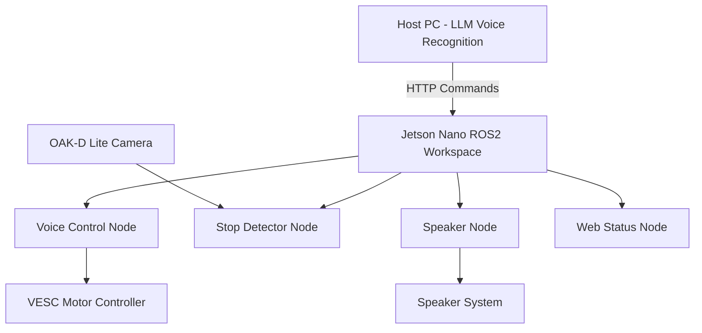

# Guide Dog Robocar
MAE/ECE 148 Final Project - Team 13 - Spring 2025

## Project Gallery

<div align="center">


*Guide Dog Robocar - Complete Side Profile*


*Complete Guide Dog Robocar - Diagonal Side View*

</div>

## Table of Contents
- [Overview](#overview)
- [Key Features](#key-features)
- [Team Members](#team-members)
- [Project Goals](#project-goals)
- [System Architecture](#system-architecture)
- [Technologies Used](#technologies-used)
- [How to Run](#how-to-run)
- [Lessons Learned](#lessons-learned)
- [Hardware Iterations](#hardware-iterations)
- [System Wiring & Electronics](#system-wiring--electronics)
- [Leash and Leash Holder](#leash-and-leash-holder)
- [Design Components](#design-components)
- [Software and Embedded Systems](#software-and-embedded-systems)
- [MAE 148 Course Concepts](#mae-148-course-concepts)
- [Future Improvements](#future-improvements)
- [Acknowledgments](#acknowledgments)
- [Contact](#contact)

## Overview

The Guide Dog Robocar is a prototype autonomous service robot designed to emulate a guide dog, offering voice-controlled navigation and hazard awareness. Using advanced speech recognition and stop-sign detection, the robot follows user commands and responds appropriately to visual stimuli. The system is built on a modular ROS2 framework, leveraging camera vision, voice integration, and a VESC motor controller for movement.

**Note:** This document is a high-level overview. For technical instructions and node setup, refer to our internal architecture notes.

## Key Features

- **Voice Recognition**: Uses an LLM running on a host PC to interpret spoken commands and send navigation instructions
- **Speaker Feedback**: Robot confirms each voice command via an integrated speaker system
- **Stop Sign Detection**: Trained model running on the OAK-D Lite recognizes stop signs and halts the robot
- **Web GUI**: Live feed and status interface displaying robot camera, stop sign triggers, and command state
- **ROS 2 Integration**: Modular node system handling camera feed, commands, stop sign detection, and control

## Team Members

| Name | Major | Year | Role/Focus |
|------|-------|------|------------|
| Qinyi Li | Electrical & Computer Engineering | Spring 2025 | Speaker Integration & Audio Systems |
| Yuyang Zhang | Biomedical Engineering | Spring 2025 | Computer Vision & Stop Sign Detection |
| Lukas Teubner | B.Sc. Engineering Science | Spring 2025 | Hardware Design & 3D Printing |
| Clarence Lai | Mechanical Engineering | Spring 2025 | Mechanical Integration & Camera Mount |

## Project Goals

### Core Objectives

**Voice Control**
- LLM model runs on PC
- ROS 2 node on Jetson receives HTTP commands
- Commands converted to `/cmd_vel` twist messages

**Stop Sign Detection**
- Roboflow-trained model detects signs using OAK-D Lite
- Sends stop commands via `/stop_cmd_twist`

**Multimodal Feedback**
- Speaker repeats commands to confirm actions
- GUI displays voice and camera feedback

### Nice-to-Have Features

- Integration with GPS for route-based commands (downgraded in final pivot)
- Leash sensor input (simulating user guidance)
- Path conflict resolution between voice and GPS nodes

## System Architecture

ROS 2-based modular system with nodes:

```
┌─────────────────┐    ┌──────────────────┐    ┌─────────────────┐
│   Host PC       │    │   Jetson Nano    │    │   Hardware      │
│                 │    │                  │    │                 │
│ ┌─────────────┐ │    │ ┌──────────────┐ │    │ ┌─────────────┐ │
│ │ LLM Voice   │ │───▶│ │ voice_control│ │───▶│ │ VESC Motor  │ │
│ │ Recognition │ │    │ │ Node         │ │    │ │ Controller  │ │
│ └─────────────┘ │    │ └──────────────┘ │    │ └─────────────┘ │
│                 │    │                  │    │                 │
│                 │    │ ┌──────────────┐ │    │ ┌─────────────┐ │
│                 │    │ │ stop_detector│ │◀───│ │ OAK-D Lite  │ │
│                 │    │ │ Node         │ │    │ │ Camera      │ │
│                 │    │ └──────────────┘ │    │ └─────────────┘ │
│                 │    │                  │    │                 │
│                 │    │ ┌──────────────┐ │    │ ┌─────────────┐ │
│                 │    │ │ speaker_node │ │───▶│ │ Speaker     │ │
│                 │    │ └──────────────┘ │    │ │ System      │ │
│                 │    │                  │    │ └─────────────┘ │
└─────────────────┘    └──────────────────┘    └─────────────────┘
```

### Node Descriptions

- `/voice_control` – Processes voice-to-command twist messages
- `/stop_detector` – Runs stop sign model and sends halt signals
- `/speaker_node` – Plays audio feedback for confirmed commands
- `/web_status_node` – Displays GUI data like live camera and states
- `/integration_node` – Manages node coordination and override logic

## Technologies Used

| Component | Technology | Purpose |
|-----------|------------|---------|
| Computer Vision | DepthAI + OAK-D Lite | Real-time camera processing and stop sign detection |
| Image Processing | OpenCV + Roboflow | On-device model for stop sign recognition |
| Framework | ROS2 (Foxy) | Communication and modular design |
| Computing Platform | Jetson Nano | Embedded platform for sensors and ROS 2 nodes |
| Motor Control | VESC | Drive and throttle control |
| Communication | HTTP Server (PC) | Hosts LLM model and sends commands to Jetson |
| Containerization | Docker | Workspace containerization |

## How to Run

### Prerequisites

- ROS2 Foxy installation
- DepthAI SDK
- Jetson Nano with Docker and ROS2 workspace configured

### Step 1: Environment Setup

```bash
# Install required dependencies
sudo apt update
sudo apt install ros-foxy-desktop
pip3 install depthai
```

### Step 2: Clone and Build

```bash
cd ~/ros2_ws/src
git clone https://github.com/your_team_repo/spring-2025-final-project-team-13
cd ..
colcon build --packages-select guide_dog_package
source install/setup.bash
```

### Step 3: Launch System

```bash
# Launch the complete guide dog system
ros2 launch guide_dog_package guide_dog.launch.py
```

### Step 4: Testing Voice Commands

```bash
# Examples of supported voice commands:
# "Move forward"
# "Turn left" 
# "Turn right"
# "Stop"
```

## Lessons Learned

### Key Discovery: Control Signal Conflicts

During implementation, we discovered that integrating GPS with voice and vision inputs led to conflicting control signals. The robot was unable to reconcile simultaneous commands from the voice interface, stop sign detector, and GPS planner.

**Solution:** We pivoted away from using GPS as a core feature, and instead treated it as a nice-to-have for future development.

**Impact:** Prioritizing clear, singular control inputs led to more reliable robot behavior and simplified our integration and debugging efforts.

### Technical Insights

- **Modular Design Benefits**: ROS2's node-based architecture made it easy to isolate and debug individual components
- **Real-time Processing**: On-device model inference with OAK-D Lite provided consistent performance
- **Voice Integration Challenges**: HTTP communication between PC and Jetson introduced latency considerations

## Hardware Iterations

Throughout the project, our team continually improved the physical integration of components to reflect functional needs and user accessibility:

### Iteration Timeline

| Version | Component | Improvement | Reason |
|---------|-----------|-------------|---------|
| v1.0 | Leash Holder | Initial position | Proof of concept |
| v2.0 | Leash Holder | Repositioned & Reprinted | Avoided wiring/camera obstruction |
| v2.1 | Power System | Dual Power Buttons | Independent module control |

### Key Improvements

- **Leash Holder Redesign**: Reprinted and repositioned to avoid obstructing wiring and camera components
- **Dual Power Buttons**: Introduced two distinct on/off buttons—one for the Jetson Nano and one for the VESC motor controller—ensuring safer testing, independent module power control, and ease of debugging during integration
- **Build Plate Evolution**: Progressed from laser-cut wooden build plate to laser-cut acrylic build plate for improved durability and aesthetics

### Hardware Evolution Gallery

**Build Plate Progression**


*First laser-cut build plate design*


*Improved newer build plate iteration with additional holes for camera mount*

**Legacy Hardware Components**


*Car with original wooden build plate and first camera mount*

**Complete System Integration**


*Complete System with new acrylic build plate, new camera mount, and leash/power button holder*

## System Wiring & Electronics

The Guide Dog Robocar integrates multiple electronic components through a carefully designed wiring system:

### Core Components

- **Jetson Nano**: Main computing platform running ROS2 nodes
- **VESC Motor Controller**: Manages drive and steering motor control
- **Battery System**: Powers both computing and motor systems
- **GPS Module**: Provides location data for navigation (future implementation)
- **OAK-D Lite Camera**: Computer vision and depth sensing
- **Speaker System**: Audio feedback for voice command confirmation

### Power Architecture

- **Dual Power Control**: Separate power buttons for Jetson Nano and VESC systems
- **Independent Shutdown**: Allows selective component testing and debugging
- **Battery Management**: Centralized power distribution with appropriate voltage regulation

### System Wiring Diagram


*Wiring diagram showing connections between VESC motor controller, Jetson Nano, battery system, GPS module, and peripheral components*

### Build Plate Evolution

Our team iterated through multiple build plate designs to optimize component mounting:

- **Wooden Build Plate (v1.0)**: Initial laser-cut wooden platform for proof of concept
- **Acrylic Build Plate (v2.0)**: Upgraded to laser-cut acrylic for better durability, weather resistance, and professional appearance

## Leash and Leash Holder

To emulate a guide dog experience, we added a physical leash to our robocar that can be pulled slightly by a human user. The leash is mounted on a 3D-printed leash holder, which is attached to the frame behind the camera.

### Dual Purpose Design

| Purpose | Description | Implementation Status |
|---------|-------------|----------------------|
| Symbolic | Reinforces the real-world analogy to guide dogs | ✅ Completed |
| Functional | Can be connected to force/angle sensor for emergency stop | 🔄 Future Work |

### Technical Specifications

- **Material**: 3D-printed PLA plastic
- **Mounting**: Rear-mounted behind camera assembly
- **Design**: Custom holder to avoid component interference

## Design Components

| Component | Designer | Description | Status |
|-----------|----------|-------------|---------|
| Jetson Mount | Internet Source | Existing design adapted for secure processor mounting | Complete |
| Camera Mount (Initial) | roncjl (Source) | Original Multiboard OAK-D Lite camera mount | Complete |
| Camera Mount (Redesigned) | Lukas | Redesigned mount for optimal positioning | Complete |
| Build Plate v1.0 | Clarence | Laser-cut wooden build plate | Complete |
| Build Plate v2.0 | Clarence | Laser-cut acrylic build plate | Complete |
| Leash Holder | Lukas | Iterated mount design for functionality | Complete |
| Speaker Mount | Lukas | Rear placement for audio feedback | Complete |
| GPS Holder | Lukas | Custom CAD design for GPS module mounting | Complete |
| Power Button Housing | Lukas | Integrated leash and power button holder | Complete |

### Component Images

**Camera Mount Design**


*Original design based on Multiboard OAK-D Lite camera mount by roncjl, redesigned by Lukas*

**GPS Holder CAD Design**


*Custom GPS module mount - Designed by Lukas*

**Speaker Mount Integration**


*Rear-mounted speaker housing - Designed by Lukas*

**Power System & Leash Integration**


*Integrated leash holder with dual power button housing - Designed by Lukas*

## Software and Embedded Systems

### System Architecture Overview



### Implementation Details

- **Host PC**: Runs LLM-based voice recognition system
- **Jetson Nano**: Receives HTTP commands and drives the ROS2 workspace
- **Remote Access**: Wireless SSH used from Mac and Windows VM to access Jetson
- **Containerization**: Docker container holds all dependencies
- **Base Platform**: UCSD Robocar Base used for chassis and motor interfacing

## MAE 148 Course Concepts

This project builds upon the core curriculum of MAE/ECE 148: Introduction to Autonomous Vehicles:

### Applied Course Concepts

| Concept | Course Application | Our Implementation |
|---------|-------------------|-------------------|
| Lane Following | Camera-based lane centering | Voice-controlled navigation |
| GPS Navigation | Waypoint tracking with GNSS | HTTP command-based movement |
| Vision Control | Object detection (stop signs, balls) | Stop sign detection with OAK-D |
| Sensor Fusion | Combining vision, GPS, IMU data | Voice + vision integration |
| ROS2 Architecture | Modular node design | Custom voice/vision nodes |

### Course Resources

- **Course Website**: [mae148.ucsd.edu](https://mae148.ucsd.edu)
- **GitHub Documentation**: [github.com/MAE-148](https://github.com/MAE-148)
- **Open-source Starter Kits**: Available through course materials

## Future Improvements

### Short-term Enhancements

- **Control Conflicts**: Resolve conflicts between continuous twist commands from voice and GPS
- **Safety Features**: Implement safer collision avoidance using GPS + camera fusion
- **NLP Expansion**: Extend vocabulary of the LLM for more natural interaction
- **Vision Robustness**: Improve stop sign detection under varying light conditions

### Long-term Vision

- **Mobile App Integration**: Develop companion app for remote monitoring
- **Audio Mapping**: Add spatial audio cues for better user guidance
- **Learning Algorithms**: Implement adaptive behavior based on user preferences
- **Accessibility Features**: Enhanced features for visually impaired users

## Acknowledgments

### Course Staff

Special thanks to Professor Jack Silberman and the dedicated Teaching Assistants:

- **Alexander** - Technical guidance and ROS2 support
- **Winston** - Hardware integration assistance
- **Vivek** - Computer vision and debugging help

### UCSD MAE 148 Program

Grateful for the comprehensive curriculum and resources provided by the UCSD MAE/ECE 148 program.

### Community Support

Big thanks to @kiers-neely for the README structure inspiration and the open-source community for their invaluable resources.

## Contact

### Team Contact Information

| Team Member | Email | Role |
|-------------|-------|------|
| Qinyi Li | qil010@ucsd.edu | Audio Systems Lead |
| Yuyang Zhang | yuz024@ucsd.edu | Computer Vision Lead |
| Lukas Teubner | lteubner@ucsd.edu | Hardware Design Lead |
| Clarence Lai | clai015@ucsd.edu | Mechanical Integration Lead |

### Project Collaboration

For questions about this project, technical implementation details, or potential collaboration opportunities, please reach out to any team member above.

---

<div align="center">

**Guide Dog Robocar - Autonomous Navigation with Heart**

*Built with care by Team 13 - Spring 2025*

</div>
