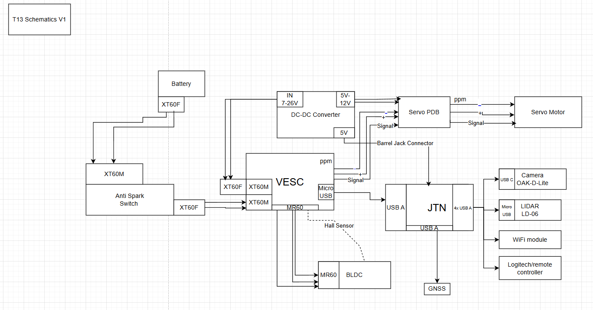

# Guide Dog Robocar
MAE/ECE 148 Final Project - Team 13 - Spring 2025

## Project Gallery

<div align="center">


*Guide Dog Robocar - Complete Side Profile*

</div>

### Live Demo Video

🎥 **[Watch our Stop Sign Recognition & Voice Control Demo](https://youtu.be/_o1pYVuZvjg)**

See the Guide Dog Robocar in action with real-time stop sign detection and voice-controlled steering, throttle, and navigation commands.

## Table of Contents
- [Overview](#overview)
- [Key Features](#key-features)
- [Team Members](#team-members)
- [Project Goals](#project-goals)
- [System Architecture](#system-architecture)
- [Technologies Used](#technologies-used)
- [How to Run](#how-to-run)
- [Lessons Learned](#lessons-learned)
- [Struggles & Challenges](#struggles--challenges)
- [Hardware Iterations](#hardware-iterations)
- [System Wiring & Electronics](#system-wiring--electronics)
- [Leash and Leash Holder](#leash-and-leash-holder)
- [Design Components](#design-components)
- [Software and Embedded Systems](#software-and-embedded-systems)
- [MAE 148 Course Concepts](#mae-148-course-concepts)
- [Future Improvements](#future-improvements)
- [Acknowledgments](#acknowledgments)
- [Contact](#contact)

## Overview

The Guide Dog Robocar is a autonomous service robot designed to emulate a guide dog, offering voice-controlled navigation and hazard alarming. Using advanced speech recognition API and stop-sign detection model from Roboflow, the robot follows user commands and responds appropriately to visual stimuli. The system is built on a modular ROS2 framework, leveraging camera vision, voice integration, and a VESC motor controller for movement and dsiplay the running status on the website GUI.

## Key Features

- **Voice Recognition**: Leverages an LLM hosted on a PC to interpret spoken commands and dispatch navigation instructions via HTTP.
- **Stop Sign Detection**: Trained the Roboflow model locally, and run it on the OAK-D Lite to recognize stop signs and halt the robot (edge deployment).
- **Speaker Feedback**: The speaker receives the ROS2 command and converts it into voice output.
- **Web GUI**: Live feed and status interface displaying robot camera, stop sign triggers, and command state.
- **ROS 2 Integration**: A modular ROS 2 node architecture integrates voice control and sign detection, prioritizing the camera feed.
  
## Team Members

| Name | Major | Year | Role/Focus |
|------|-------|------|------------|
| Qinyi Li | Electrical & Computer Engineering | Spring 2025 | Stop Sign Detection & Audio Systems |
| Yuyang Zhang | Biomedical Engineering | Spring 2025 | Configuration and Integration & Ros2 Nodes Construction |
| Lukas Teubner | B.Sc. Engineering Science | Spring 2025 | Hardware Design & 3D Printing |
| Clarence Lai | Mechanical Engineering | Spring 2025 | Mechanical Integration & Camera Mount |

## Project Goals

### Core Objectives

**Voice Control**
- usage of gemini LLM model 
- able to translate commands into specific angle, speed and time
- ROS2 node on Jetson receives HTTP commands
- Commands converted to `/cmd_vel` twist messages

**Stop Sign Detection**
- locally trained Roboflow model
- run the model directly on the OAK-D Lite to detect stop sign
- Sends stop commands via `/stop_cmd_twist`
- Car automatically stops when stop sign is detected
- Integration with voice control
  
### Nice-to-Have Features
- Speaker for alarming 
- GUI displays voice and camera feedback
- Integration with GPS

## Core Components

- **Jetson Nano**: Main computing platform running ROS2 nodes
- **VESC Motor Controller**: Manages drive and steering motor control
- **Battery System**: Powers both computing and motor systems
- **GPS Module**: Provides location data for navigation (future implementation)
- **OAK-D Lite Camera**: Computer vision and depth sensing
- **Speaker System**: Audio feedback for voice command confirmation

### Implementation Details

- **Host PC**: Runs LLM-based voice recognition system
- **Jetson Nano**: Receives HTTP commands and drives the ROS2 workspace
- **Remote Access**: Wireless SSH used from Mac and Windows VM to access Jetson
- **Containerization**: Docker container holds all dependencies
- **Base Platform**: UCSD Robocar Base used for chassis and motor interfacing

## System Architecture


### Node Descriptions

- `/voice_control` – Processes voice-to-command twist messages
- `/stop_detector` – Runs stop sign model and sends halt signals
- `/speaker_node` – Plays audio feedback for confirmed commands
- `/web_status_node` – Displays GUI data on the website like live camera and states
- `/integration_node` – Manages node coordination and override logic

## Technologies Used

| Component | Technology | Purpose |
|-----------|------------|---------|
| Computer Vision | DepthAI + OAK-D Lite + OpenCV | On-device Real-time camera processing and stop sign detection |
| Framework | ROS2 (Foxy) | Communication and modular design |
| Computing Platform | Jetson Nano | Embedded platform for sensors and ROS 2 nodes |
| Motor Control | VESC | Drive and throttle control |
| Communication | HTTP Server (PC) | Hosts LLM model and sends commands to Jetson |
| Containerization | Docker | Workspace containerization |

## How to Run

### Prerequisites
- locally trained camera model, programs designed for the audio system and designed GUI
- hardwares connected to the jetson/laptop
- Jetson Container setup
- ROS2 Foxy installation
- Jetson Nano with Docker and ROS2 workspace configured

### Step 1: Environment Setup

```bash
# Get into the container
source ~/.bashrc
docker start test_container
docker exec -it test_container bash
cd ros2_ws
# Install required dependencies
sudo apt update
sudo apt install ros-foxy-desktop
pip3 install depthai
```
Simple command leads to go straight

Command leads to turn left

Command leads to turn right

Command leads to turn reverse

Advanced Command leads includes both speed and angle


### Step 2: Clone and Build

```bash
cd ~/ros2_ws/src
git clone https://github.com/your_team_repo/spring-2025-final-project-team-13
cd ..
colcon build 
source /opt/ros/foxy/setup.bash
source install/setup.bash
```

### Step 3: Testing Voice Control
#### on the laptop
```bash
python speech_processing_runner.py
```
#### in the Jetson
```bash
# Open the HTTP
cd projects/d4
source ~/projects/envs/donkey/bin/activate
python3 manage.py drive
# have to change the setting in the manage.py to make other inputs work
export DONKEYCAR_ENDPOINT
python3 src/final_projects/final_projects/voice_control.py
```
#### All commands which start with "go go go" will be detected
#### Just with "go go go", the car will go straight at the dafault throttle of 0.2
#### Both simple commands like "stop", "turn left" and advanced commands including specific value of speed and steering are allowed
#### Examples of supported voice commands:
##### "go go go turn backwards"
##### "go go go turn left at the angle of 30 degrees at the speed of 0.3"
#### The terminal on the laptop will display the command including throttle and angle and "send successfully"


### Step 4: Testing Stop Sign Detector
#### Download the self-labelled and collected dataset from Roboflow and train it locally, then upload both the .blob and .yolo file to the container
```bash
python3 src/final_projects/final_projects/stop_detector.py
```
#### The terminal will display the FPS and whether it detects the sign. If true, a stop command will be sent to the integration_node as priority

### Step 5: Testing Speaker and GUI
```bash
python3 src/final_projects/final_projects/speaker.py
python3 src/final_projects/final_projects/user_web.py
```
#### While the running status changes, the speaker will podcast the new status like "moving forward", "turning left" and "reversing".
#### The GUI on the website will display the Jetson Car Dashboard including "speed", "angular", "detected status" and the live camera feed.

### Step 6: Launch the robocar
```bash
# launch the ros2 node to control the VESC
ros2 launch ucsd_robocar_actuator2_pkg vesc_twist.launch.py
```
#### The node will subscribe to the topic: /cmd_vel and control the VESC.

## Challenges

### LLM integration with Jetson
We initially intended to integrate the Gemini LLM onto the Jetson directly, however, due to the limited computational ability of the Jetson, the accuracy of recognition is low. Therefore, we moved the model back to the laptop and sent the commands to Jetson via HTTP. Still, the time latency is about 10 seconds probably due to the complex communiation between jetson/nodes/vesc/laptop.

#### Possible Solution: 
Run a lightweight speech-recognition model directly on the Jetson instead of HTTP. 

### GPS Signal Conflicts

During implementation, we discovered that integrating GPS with voice and vision inputs led to conflicts with control signals. The robot was unable to reconcile simultaneous commands from the voice interface, stop sign detector, and GPS planner. Besides, some commands we want to realize are against the current GPS system, like "speed up" also requires to alter PID.

#### Possible Solution
Let the integration_node subscribe the GPS information if possible and change the code for integration to deal with inputs properly. Furthermore,  we should write a code to automatically alter the PID when speeding up.


## Potential Improvements

### Short-term Enhancements

- **Control Conflicts**: Resolve conflicts between continuous twist commands from voice and GPS
- **Safety Features**: Implement safer collision avoidance using GPS + camera fusion
- **Vision Robustness**: Improve stop sign detection under varying light conditions

### Long-term Vision

- **Mobile App Integration**: Develop companion app for remote monitoring
- **Audio Mapping**: Add spatial audio cues for better user guidance
- **Learning Algorithms**: Implement adaptive behavior based on user preferences
- **Accessibility Features**: Enhanced features for visually impaired users

## Struggles

### Hardware Struggles

Our journey building the Guide Dog Robocar was filled with hardware challenges that tested our problem-solving skills and determination. Each setback became a learning opportunity, though some came at the most inconvenient times.

**GPS Module Headaches**
During our GPS navigation implementation, we constantly battled with PID tuning. Every time we wanted to test different speeds for our GPS laps, we had to recalibrate the PID values from scratch. To make matters worse, our GPS modules kept experiencing cable connection issues, causing intermittent failures that made debugging a nightmare.

**The Great Jetson Crisis of Race Day**
Perhaps our most stressful moment came the night before the racing day in May. At 11:30 PM, disaster struck – our Jetson Nano's ports completely stopped working. With the race less than 12 hours away, panic set in. Thanks to Kevin and Winston's help for debugging and backing up data late in the night, and Alex's suggestion to switch to a new jetson, we were finally able to have our car run about 2 hours before the race without having to setup everything again which sounded horrible . This last-minute hardware failure forced us to collaborate with Team 4 on race day, as we weren't sure our car would function at all. However, our persistence paid off – our car finally worked on race day since we had properly configured the GPS PID values and could reuse them with the new Jetson.

**VESC and Power System Woes**
Our VESC motor controller proved to be another persistent source of frustration. After numerous malfunctions, we finally decided to replace it entirely. However, the new VESC required modifications to our custom leash/power button mount plate, since it came with a separate power button configuration. This meant reprinting and redesigning components we thought were finalized.

**Battery and Suspension Failures**
As if electronic issues weren't enough, our batteries failed multiple times throughout the project, each time requiring replacement and system recalibration. Our car's suspension system also gave out, necessitating a complete replacement that temporarily sidelined our testing.

**Camera Mount Evolution**
For our lane following implementation, we discovered our camera positioning wasn't optimal. This led to designing and 3D printing a custom camera extension for our camera mount, adding another iteration to our hardware design cycle.

### Team Challenges

**Foreign Student Experience**
Adding an extra layer of complexity to our project, three out of four team members were foreign exchange students new to UCSD. Navigating an unfamiliar campus, understanding American academic systems, and adapting to different engineering practices while building a complex autonomous vehicle created unique challenges. We had to learn not just the technical aspects of robotics, but also how to effectively collaborate across different cultural approaches to engineering and problem-solving.

Despite these numerous setbacks, each challenge strengthened our team's resilience and problem-solving abilities. The combination of hardware failures, time pressure, and cultural adaptation made our eventual success even more rewarding.

## Project Management Learnings

**Time Estimation Reality Check**
We learned the hard way to overestimate how long things actually take. What seemed like a "30-minute PID tuning session" often turned into hours of debugging. Hardware failures, cable issues, and unexpected software conflicts consistently derailed our timeline estimates. Our advice: triple your initial time estimates and you might be close to reality.

**The Art of Troubleshooting**
Every component failure taught us systematic troubleshooting skills. When something broke, we learned to:
- Isolate the problem by testing components individually
- Check the obvious things first (cables, power, connections)
- Document what worked before vs. what changed
- Keep spare components when possible
- Never assume it's a software issue until you've ruled out hardware

**Adaptability Under Pressure**
The Jetson failure at 11:30 PM the night before race day became our masterclass in crisis management. We learned that having good documentation, modular code architecture, and maintaining relationships with TAs and other teams can save your project. Being adaptable meant quickly pivoting from panic to problem-solving mode.

**Creative Problem-Solving**
When conventional solutions failed, creativity became our best tool:
- Used 3D printing to rapidly prototype custom mounts and holders
- Repurposed everyday items for temporary fixes during testing
- Collaborated with other teams when our hardware was unreliable
- Found innovative ways to integrate multiple sensors without interference
- Developed workarounds for component limitations (like our dual power button solution)

**Communication is Everything**
Working as a team with diverse backgrounds taught us that clear communication prevents most problems. Regular check-ins, shared documentation, and explaining technical concepts across different expertise levels became crucial for success.

**Backup Plans Save Projects**
Always have a backup plan. Whether it's spare hardware, alternative software approaches, or team collaboration strategies, redundancy in planning proved invaluable when primary systems failed.

## Hardware Iterations

Throughout the project, our team continually improved the physical integration of components to reflect functional needs and user accessibility:

### System Wiring Diagram



*Wiring diagram showing connections between VESC motor controller, Jetson Nano, battery system, GPS module, and peripheral components*

**Complete System Integration**


*Complete System with new acrylic build plate, new camera mount, and leash/power button holder*

### Key Improvements

- **Leash Holder Redesign**: Reprinted and repositioned to avoid obstructing wiring and camera components
- **Dual Power Buttons**: Introduced two distinct on/off buttons—one for the Jetson Nano and one for the VESC motor controller—ensuring safer testing, independent module power control, and ease of debugging during integration
- **Build Plate Evolution**: Progressed from laser-cut wooden build plate to laser-cut acrylic build plate for improved durability and aesthetics

### Component Images
**Plate Design**


**Camera Mount Design**


**GPS Holder CAD Design**


**Power System & Leash Integration**


**Speaker Mount Integration**


## MAE 148 Course Concepts
This project builds upon the core curriculum of MAE/ECE 148: Introduction to Autonomous Vehicles:

### Course Deliverables

Throughout the MAE 148 course, our team completed several key deliverables that formed the foundation for our final Guide Dog Robocar project:

🎥 **[Lane Following Demo](https://www.youtube.com/watch?v=O8um_w0W6vo)** - Implementation of camera-based lane detection and following using computer vision techniques. This deliverable established our foundation in autonomous navigation and real-time image processing.

🎥 **[GPS Navigation Demo](https://youtu.be/LwVt_FhyUHY)** - Autonomous GPS navigation system performing waypoint-based laps around the track. This deliverable was integrated into our final project as a secondary navigation mode, though we pivoted to prioritize voice control due to control signal conflicts.

🎥 **[DonkeyCar 3 Deep Learning Laps](https://youtu.be/lJ9elERHlCk)** - Machine learning-based autonomous driving using behavioral cloning. The car learned to navigate the track through end-to-end deep learning, training on human driving data to perform autonomous laps.

### Course Resources

- **Course Website**: [mae148.ucsd.edu](https://mae148.ucsd.edu)
- **GitHub Documentation**: [github.com/MAE-148](https://github.com/MAE-148)
- **Open-source Starter Kits**: Available through course materials

## Acknowledgments

### Course Staff

Special thanks to Professor Jack Silberman and the dedicated Teaching Assistants:

- **Alexander** - Hardware support and technical guidance
- **Winston** - Helping with the Jetson recovery
- **Jingli** - Voluntary help and support

### UCSD MAE 148 Program

Grateful for the comprehensive curriculum and resources provided by the UCSD MAE/ECE 148 program.

### Community Support

Big thanks to @kiers-neely for the README structure inspiration and the open-source community for their invaluable resources.

## Contact

### Team Contact Information

| Team Member | Role |
|-------------|------|
| Qinyi Li | Software design Lead |
| Yuyang Zhang | ROS2 construction Lead |
| Lukas Teubner | Hardware Design Lead |
| Clarence Lai | Mechanical Integration Lead |

### Project Collaboration

For questions about this project, technical implementation details, or potential collaboration opportunities, please contact the team through this repository.

---

<div align="center">

**Guide Dog Robocar - Autonomous Navigation with Heart**

*Built with care by Team 13 - Spring 2025*

</div>
