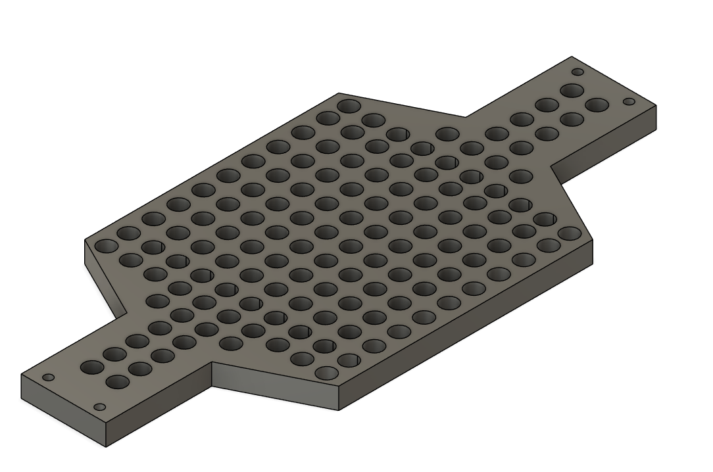

# Guide Dog Robocar
MAE/ECE 148 Final Project - Team 13 - Spring 2025

## Project Gallery

<div align="center">


*Guide Dog Robocar - Complete Side Profile*


*Complete Guide Dog Robocar - Diagonal Side View*

</div>

### Live Demo Video

🎥 **[Watch our Stop Sign Recognition & Voice Control Demo](https://youtu.be/_o1pYVuZvjg)**

See the Guide Dog Robocar in action with real-time stop sign detection and voice-controlled steering, throttle, and navigation commands.

## Table of Contents
- [Overview](#overview)
- [Key Features](#key-features)
- [Team Members](#team-members)
- [Project Goals](#project-goals)
- [System Architecture](#system-architecture)
- [Technologies Used](#technologies-used)
- [How to Run](#how-to-run)
- [Lessons Learned](#lessons-learned)
- [Struggles & Challenges](#struggles--challenges)
- [Hardware Iterations](#hardware-iterations)
- [System Wiring & Electronics](#system-wiring--electronics)
- [Leash and Leash Holder](#leash-and-leash-holder)
- [Design Components](#design-components)
- [Software and Embedded Systems](#software-and-embedded-systems)
- [MAE 148 Course Concepts](#mae-148-course-concepts)
- [Future Improvements](#future-improvements)
- [Acknowledgments](#acknowledgments)
- [Contact](#contact)

## Overview

The Guide Dog Robocar is a autonomous service robot designed to emulate a guide dog, offering voice-controlled navigation and hazard alarming. Using advanced speech recognition API and stop-sign detection model from Roboflow, the robot follows user commands and responds appropriately to visual stimuli. The system is built on a modular ROS2 framework, leveraging camera vision, voice integration, and a VESC motor controller for movement and dsiplay the running status on the website GUI.

## Key Features

- **Voice Recognition**: Leverages an LLM hosted on a PC to interpret spoken commands and dispatch navigation instructions via HTTP.
- **Stop Sign Detection**: Trained model from the Roboflow running on the OAK-D Lite recognizes stop signs and halts the robot。
- **Speaker Feedback**: The speaker receives the ROS2 command and converts it into voice output.
- **Web GUI**: Live feed and status interface displaying robot camera, stop sign triggers, and command state
- **ROS 2 Integration**: A modular ROS 2 node architecture integrates voice control and sign detection, prioritizing the camera feed.
  
## Team Members

| Name | Major | Year | Role/Focus |
|------|-------|------|------------|
| Qinyi Li | Electrical & Computer Engineering | Spring 2025 | Speaker Integration & Audio Systems |
| Yuyang Zhang | Biomedical Engineering | Spring 2025 | Computer Vision & Stop Sign Detection |
| Lukas Teubner | B.Sc. Engineering Science | Spring 2025 | Hardware Design & 3D Printing |
| Clarence Lai | Mechanical Engineering | Spring 2025 | Mechanical Integration & Camera Mount |

## Project Goals

### Core Objectives

**Voice Control**
- LLM model runs on PC
- ROS 2 node on Jetson receives HTTP commands
- Commands converted to `/cmd_vel` twist messages
- basic commands like "start", "stop" and "turn left" 
- Advanced commands like "turn left with speed of 0.3 at the angle of 30 degrees"

**Stop Sign Detection**
- Roboflow-trained model detects signs using OAK-D Lite
- Sends stop commands via `/stop_cmd_twist`
- Car automatically stops when stop sign is detected
- Integration with voice control
  
### Nice-to-Have Features
- Speaker commands for alarming 
- GUI displays voice and camera feedback
- Integration with GPS

## System Architecture


### Node Descriptions

- `/voice_control` – Processes voice-to-command twist messages
- `/stop_detector` – Runs stop sign model and sends halt signals
- `/speaker_node` – Plays audio feedback for confirmed commands
- `/web_status_node` – Displays GUI data on the website like live camera and states
- `/integration_node` – Manages node coordination and override logic

## Technologies Used

| Component | Technology | Purpose |
|-----------|------------|---------|
| Computer Vision | DepthAI + OAK-D Lite | Real-time camera processing and stop sign detection |
| Image Processing | OpenCV + Roboflow | On-device model for stop sign recognition |
| Framework | ROS2 (Foxy) | Communication and modular design |
| Computing Platform | Jetson Nano | Embedded platform for sensors and ROS 2 nodes |
| Motor Control | VESC | Drive and throttle control |
| Communication | HTTP Server (PC) | Hosts LLM model and sends commands to Jetson |
| Containerization | Docker | Workspace containerization |

## How to Run

### Prerequisites
- Jetson Container setup
- ROS2 Foxy installation
- DepthAI SDK
- Jetson Nano with Docker and ROS2 workspace configured

### Step 1: Environment Setup

```bash
# Install required dependencies
sudo apt update
sudo apt install ros-foxy-desktop
pip3 install depthai
```

### Step 2: Clone and Build

```bash
cd ~/ros2_ws/src
git clone https://github.com/your_team_repo/spring-2025-final-project-team-13
cd ..
colcon build --packages-select guide_dog_package
source /opt/ros/foxy/setup.bash
source install/setup.bash
```

### Step 3: Testing Voice Commands
on the laptop

in the Jetson
```bash
# Open the HTTP
cd projects/d4
source ~/projects/envs/donkey/bin/activate
python3 manage.py drive
# have to change the setting in the manage.py to make other inputs work
export DONKEYCAR_ENDPOINT
python3 src/final_projects/final_projects/voice_control.py
```
#### All commands start with "go go go" will be detected
#### Just with "go go go", the car will go straight at the throttle of 0.2
#### Both simple commands like "stop", "turn left" and advanced commands including specific value of speed and steering are allowed
#### Examples of supported voice commands:
 "go go go turn backwards"
 "go go go turn left at the angle of 30 degrees and the speed of 0.3"
 The terminal on the laptop will display the command including throttle and angle and "send successfully"


### Step 4: Testing Stop Sign Detector

### Step 5: Testing Stop Sign Detector
### Step 6: Launch the robocr


## Lessons Learned

### Key Discovery: Control Signal Conflicts

During implementation, we discovered that integrating GPS with voice and vision inputs led to conflicting control signals. The robot was unable to reconcile simultaneous commands from the voice interface, stop sign detector, and GPS planner.

**Solution:** We pivoted away from using GPS as a core feature, and instead treated it as a nice-to-have for future development.

**Impact:** Prioritizing clear, singular control inputs led to more reliable robot behavior and simplified our integration and debugging efforts.

### Technical Insights

- **Modular Design Benefits**: ROS2's node-based architecture made it easy to isolate and debug individual components
- **Real-time Processing**: On-device model inference with OAK-D Lite provided consistent performance
- **Voice Integration Challenges**: HTTP communication between PC and Jetson introduced latency considerations

### Project Management Learnings

**Time Estimation Reality Check**
We learned the hard way to overestimate how long things actually take. What seemed like a "30-minute PID tuning session" often turned into hours of debugging. Hardware failures, cable issues, and unexpected software conflicts consistently derailed our timeline estimates. Our advice: triple your initial time estimates and you might be close to reality.

**The Art of Troubleshooting**
Every component failure taught us systematic troubleshooting skills. When something broke, we learned to:
- Isolate the problem by testing components individually
- Check the obvious things first (cables, power, connections)
- Document what worked before vs. what changed
- Keep spare components when possible
- Never assume it's a software issue until you've ruled out hardware

**Adaptability Under Pressure**
The Jetson failure at 11:30 PM the night before race day became our masterclass in crisis management. We learned that having good documentation, modular code architecture, and maintaining relationships with TAs and other teams can save your project. Being adaptable meant quickly pivoting from panic to problem-solving mode.

**Creative Problem-Solving**
When conventional solutions failed, creativity became our best tool:
- Used 3D printing to rapidly prototype custom mounts and holders
- Repurposed everyday items for temporary fixes during testing
- Collaborated with other teams when our hardware was unreliable
- Found innovative ways to integrate multiple sensors without interference
- Developed workarounds for component limitations (like our dual power button solution)

**Communication is Everything**
Working as a team with diverse backgrounds taught us that clear communication prevents most problems. Regular check-ins, shared documentation, and explaining technical concepts across different expertise levels became crucial for success.

**Backup Plans Save Projects**
Always have a backup plan. Whether it's spare hardware, alternative software approaches, or team collaboration strategies, redundancy in planning proved invaluable when primary systems failed.

## Struggles & Challenges

### Hardware Struggles

Our journey building the Guide Dog Robocar was filled with hardware challenges that tested our problem-solving skills and determination. Each setback became a learning opportunity, though some came at the most inconvenient times.

**GPS Module Headaches**
During our GPS navigation implementation, we constantly battled with PID tuning. Every time we wanted to test different speeds for our GPS laps, we had to recalibrate the PID values from scratch. To make matters worse, our GPS modules kept experiencing cable connection issues, causing intermittent failures that made debugging a nightmare.

**The Great Jetson Crisis of Race Day**
Perhaps our most stressful moment came the night before the racing day in May. At 11:30 PM, disaster struck – our Jetson Nano's ports completely stopped working. With the race less than 12 hours away, panic set in. Fortunately, our TA Alex came to the rescue, helping us swap out the entire Jetson unit while preserving our SD card with all our precious code. This last-minute hardware failure forced us to collaborate with Team 4 on race day, as we weren't sure our car would function at all. However, our persistence paid off – our car finally worked on race day since we had properly configured the GPS PID values and could reuse them with the new Jetson.

**VESC and Power System Woes**
Our VESC motor controller proved to be another persistent source of frustration. After numerous malfunctions, we finally decided to replace it entirely. However, the new VESC required modifications to our custom leash/power button mount plate, since it came with a separate power button configuration. This meant reprinting and redesigning components we thought were finalized.

**Battery and Suspension Failures**
As if electronic issues weren't enough, our batteries failed multiple times throughout the project, each time requiring replacement and system recalibration. Our car's suspension system also gave out, necessitating a complete replacement that temporarily sidelined our testing.

**Camera Mount Evolution**
For our lane following implementation, we discovered our camera positioning wasn't optimal. This led to designing and 3D printing a custom camera extension for our camera mount, adding another iteration to our hardware design cycle.

### Team Challenges

**Foreign Student Experience**
Adding an extra layer of complexity to our project, three out of four team members were foreign exchange students new to UCSD. Navigating an unfamiliar campus, understanding American academic systems, and adapting to different engineering practices while building a complex autonomous vehicle created unique challenges. We had to learn not just the technical aspects of robotics, but also how to effectively collaborate across different cultural approaches to engineering and problem-solving.

Despite these numerous setbacks, each challenge strengthened our team's resilience and problem-solving abilities. The combination of hardware failures, time pressure, and cultural adaptation made our eventual success even more rewarding.

## Hardware Iterations

Throughout the project, our team continually improved the physical integration of components to reflect functional needs and user accessibility:

### Iteration Timeline

| Version | Component | Improvement | Reason |
|---------|-----------|-------------|---------|
| v1.0 | Camera Mount | Initial online-found design | Proof of concept |
| v1.1 | Camera Mount | Custom-designed mount | Improved stability and better positioning |
| v1.0 | Leash Holder | Initial position | Proof of concept |
| v2.0 | Leash Holder | Repositioned & Reprinted | Better fixture of the leash and avoided wiring/camera obstruction |
| v2.1 | Power System | Dual Power Buttons | Independent module control |

### Key Improvements

- **Leash Holder Redesign**: Reprinted and repositioned to avoid obstructing wiring and camera components
- **Dual Power Buttons**: Introduced two distinct on/off buttons—one for the Jetson Nano and one for the VESC motor controller—ensuring safer testing, independent module power control, and ease of debugging during integration
- **Build Plate Evolution**: Progressed from laser-cut wooden build plate to laser-cut acrylic build plate for improved durability and aesthetics

### Hardware Evolution Gallery

**Build Plate Progression**


*First laser-cut build plate design*



*Improved newer build plate iteration with additional holes for camera mount*

**Legacy Hardware Components**


*Car with original wooden build plate and first camera mount*

**Complete System Integration**


*Complete System with new acrylic build plate, new camera mount, and leash/power button holder*

## System Wiring & Electronics

The Guide Dog Robocar integrates multiple electronic components through a carefully designed wiring system:

### Core Components

- **Jetson Nano**: Main computing platform running ROS2 nodes
- **VESC Motor Controller**: Manages drive and steering motor control
- **Battery System**: Powers both computing and motor systems
- **GPS Module**: Provides location data for navigation (future implementation)
- **OAK-D Lite Camera**: Computer vision and depth sensing
- **Speaker System**: Audio feedback for voice command confirmation

### Power Architecture

- **Dual Power Control**: Separate power buttons for Jetson Nano and VESC systems
- **Independent Shutdown**: Allows selective component testing and debugging
- **Battery Management**: Centralized power distribution with appropriate voltage regulation

### System Wiring Diagram


*Wiring diagram showing connections between VESC motor controller, Jetson Nano, battery system, GPS module, and peripheral components*

### Build Plate Evolution

Our team iterated through multiple build plate designs to optimize component mounting:

- **Wooden Build Plate (v1.0)**: Initial laser-cut wooden platform for proof of concept
- **Acrylic Build Plate (v2.0)**: Upgraded to laser-cut acrylic for better durability, weather resistance, and professional appearance

## Leash and Leash Holder

To emulate a guide dog experience, we added a physical leash to our robocar that can be pulled slightly by a human user. The leash is mounted on a 3D-printed leash holder, which is attached to the frame behind the camera.

### Dual Purpose Design

| Purpose | Description | Implementation Status |
|---------|-------------|----------------------|
| Symbolic | Reinforces the real-world analogy to guide dogs | ✅ Completed |
| Functional | Can be connected to force/angle sensor for emergency stop | 🔄 Future Work |

### Technical Specifications

- **Material**: 3D-printed PLA plastic
- **Mounting**: Rear-mounted behind camera assembly
- **Design**: Custom holder to avoid component interference

## Design Components

| Component | Designer | Description | Status |
|-----------|----------|-------------|---------|
| Jetson Mount | Internet Source | Existing design adapted for secure processor mounting | Complete |
| Camera Mount (Initial) | roncjl (Source) | Original Multiboard OAK-D Lite camera mount | Complete |
| Camera Mount (Redesigned) | Lukas | Redesigned mount for optimal positioning | Complete |
| Build Plate v1.0 | Clarence | Laser-cut wooden build plate | Complete |
| Build Plate v2.0 | Clarence | Laser-cut acrylic build plate | Complete |
| Leash Holder | Lukas | Iterated mount design for functionality | Complete |
| Speaker Mount | Lukas | Rear placement for audio feedback | Complete |
| GPS Holder | Lukas | Custom CAD design for GPS module mounting | Complete |
| Power Button Housing | Lukas | Integrated leash and power button holder | Complete |

### Component Images

**Camera Mount Design**


*Original design based on Multiboard OAK-D Lite camera mount by roncjl, redesigned by Lukas*

**GPS Holder CAD Design**


*Custom GPS module mount - Designed by Lukas*

**Speaker Mount Integration**


*Rear-mounted speaker housing - Designed by Lukas*

**Power System & Leash Integration**


*Integrated leash holder with dual power button housing - Designed by Lukas*

## Software and Embedded Systems

### System Architecture Overview


### Implementation Details

- **Host PC**: Runs LLM-based voice recognition system
- **Jetson Nano**: Receives HTTP commands and drives the ROS2 workspace
- **Remote Access**: Wireless SSH used from Mac and Windows VM to access Jetson
- **Containerization**: Docker container holds all dependencies
- **Base Platform**: UCSD Robocar Base used for chassis and motor interfacing

## MAE 148 Course Concepts

This project builds upon the core curriculum of MAE/ECE 148: Introduction to Autonomous Vehicles:

### Applied Course Concepts

| Concept | Course Application | Our Implementation |
|---------|-------------------|-------------------|
| Lane Following | Camera-based lane centering | Voice-controlled navigation |
| GPS Navigation | Waypoint tracking with GNSS | HTTP command-based movement |
| Vision Control | Object detection (stop signs, balls) | Stop sign detection with OAK-D |
| Sensor Fusion | Combining vision, GPS, IMU data | Voice + vision integration |
| ROS2 Architecture | Modular node design | Custom voice/vision nodes |

### Course Deliverables

Throughout the MAE 148 course, our team completed several key deliverables that formed the foundation for our final Guide Dog Robocar project:

🎥 **[Lane Following Demo](https://www.youtube.com/watch?v=O8um_w0W6vo)** - Implementation of camera-based lane detection and following using computer vision techniques. This deliverable established our foundation in autonomous navigation and real-time image processing.

🎥 **[GPS Navigation Demo](https://youtu.be/LwVt_FhyUHY)** - Autonomous GPS navigation system performing waypoint-based laps around the track. This deliverable was integrated into our final project as a secondary navigation mode, though we pivoted to prioritize voice control due to control signal conflicts.

🎥 **[DonkeyCar 3 Deep Learning Laps](https://youtu.be/lJ9elERHlCk)** - Machine learning-based autonomous driving using behavioral cloning. The car learned to navigate the track through end-to-end deep learning, training on human driving data to perform autonomous laps.

### Course Resources

- **Course Website**: [mae148.ucsd.edu](https://mae148.ucsd.edu)
- **GitHub Documentation**: [github.com/MAE-148](https://github.com/MAE-148)
- **Open-source Starter Kits**: Available through course materials

## Future Improvements

### Short-term Enhancements

- **Control Conflicts**: Resolve conflicts between continuous twist commands from voice and GPS
- **Safety Features**: Implement safer collision avoidance using GPS + camera fusion
- **NLP Expansion**: Extend vocabulary of the LLM for more natural interaction
- **Vision Robustness**: Improve stop sign detection under varying light conditions

### Long-term Vision

- **Mobile App Integration**: Develop companion app for remote monitoring
- **Audio Mapping**: Add spatial audio cues for better user guidance
- **Learning Algorithms**: Implement adaptive behavior based on user preferences
- **Accessibility Features**: Enhanced features for visually impaired users

## Acknowledgments

### Course Staff

Special thanks to Professor Jack Silberman and the dedicated Teaching Assistants:

- **Alexander** - Hardware support and technical guidance
- **Winston** - Helping with the Jetson recovery
- **Jing Li** - Voluntary help and support

### UCSD MAE 148 Program

Grateful for the comprehensive curriculum and resources provided by the UCSD MAE/ECE 148 program.

### Community Support

Big thanks to @kiers-neely for the README structure inspiration and the open-source community for their invaluable resources.

## Contact

### Team Contact Information

| Team Member | Role |
|-------------|------|
| Qinyi Li | Audio Systems Lead |
| Yuyang Zhang | Computer Vision Lead |
| Lukas Teubner | Hardware Design Lead |
| Clarence Lai | Mechanical Integration Lead |

### Project Collaboration

For questions about this project, technical implementation details, or potential collaboration opportunities, please contact the team through this repository.

---

<div align="center">

**Guide Dog Robocar - Autonomous Navigation with Heart**

*Built with care by Team 13 - Spring 2025*

</div>
